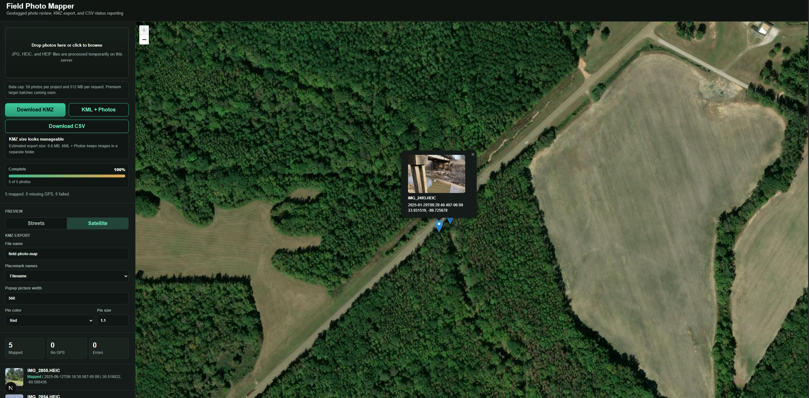
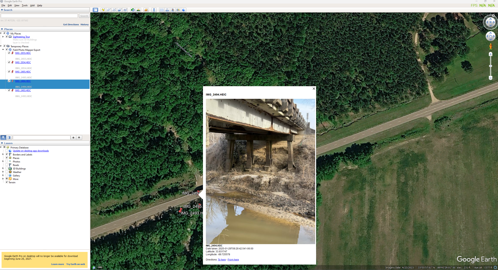

# Field Photo Mapper

> Turn a folder of geotagged field photos into a map, a Google Earth tour, and a clean status report.

Field Photo Mapper is a self-hosted web app for reviewing JPG, JPEG, HEIC, and HEIF photos on an interactive map. It reads their GPS coordinates and capture dates, then exports KMZ, KML + Photos, and CSV files for project documentation and field review.

Built with Next.js, React, TypeScript, and Leaflet. Photos are processed on the server with `exifr`, ExifTool, Sharp, and `heic-convert`; ZIP exports use JSZip.

## See it in action

<table>
  <tr>
    <td width="50%" valign="top">
      
      <p><strong>Review the field set.</strong><br />Upload photos, inspect the map, open a preview, and choose export options in one workspace.</p>
    </td>
    <td width="50%" valign="top">
      
      <p><strong>Open the result in Google Earth Pro.</strong><br />Each KMZ placemark can show the photo preview, filename, date, and coordinates.</p>
    </td>
  </tr>
</table>

## Features

- Drag-and-drop uploads with per-photo progress and thumbnails.
- GPS coordinates and capture dates extracted from photo metadata.
- Street and satellite maps with clickable photo markers and automatic map framing.
- Separate counts for mapped photos, missing GPS data, and processing errors.
- Custom export filenames, placemark names, pin colors, pin sizes, and popup image widths.
- Temporary server storage, optional shared-password access, and Docker deployment.

The current beta interface accepts up to **50 photos per project**. The server defaults to a **512 MB limit on uploaded file bytes per request**; the browser uploads one photo per request.

## Try the included sample set

Five GPS-tagged HEIC field photos are included in [examples/sample-field-photos](examples/sample-field-photos). They are the source files used for the screenshots above and give you a quick way to test the full upload-to-KMZ workflow.

```text
examples/sample-field-photos/
├── IMG_2493.HEIC
├── IMG_2494.HEIC
├── IMG_2495.HEIC
├── IMG_2854.HEIC
└── IMG_2855.HEIC
```

## Run with Docker

Install Docker with Compose support. On Windows, use Docker Desktop with Linux containers enabled. From the project directory:

```powershell
Copy-Item .env.example .env
notepad .env
```

Replace `FIELD_MAPPER_PASSWORD` with your own shared password, or leave it empty to disable the password prompt. The Cloudflare token is only needed when using the optional tunnel profile.

```powershell
docker compose up -d --build
```

Open [http://localhost:8080](http://localhost:8080). If password protection is enabled, enter any username and the configured password; only the password is checked.

Useful commands:

```powershell
docker compose logs -f field-photo-mapper
docker compose ps
docker compose down
```

Compose stores temporary uploads in the `field-photo-temp` named volume, mounted at `/app/tmp`. Stopping the containers does not remove this volume.

## Local development

Use Node.js 20.9 or newer and npm. The Docker image uses Node.js 20.

```sh
npm install
```

Optionally create `.env.local` in the project root:

```dotenv
FIELD_MAPPER_PASSWORD=
MAX_UPLOAD_MB=512
MAX_PHOTOS_PER_JOB=50
```

Start the development server:

```sh
npm run dev
```

Open [http://localhost:8080](http://localhost:8080).

| Command | Purpose |
| --- | --- |
| `npm run dev` | Start the development server on port 8080. |
| `npm run build` | Build the production application. |
| `npm start` | Run the production build on port 8080. |
| `npm run lint` | Run the Next.js ESLint checks. |

There is currently no automated test script in `package.json`.

## Using the app

1. Drop photos onto the upload area or click it to select files. Each new selection starts a new project in the interface.
2. Wait for processing to finish. Review the mapped, missing-GPS, and error counts alongside the photo list.
3. Switch between Streets and Satellite, then click a marker to see its photo preview, filename, date, and coordinates.
4. Set the export filename, placemark naming style, popup picture width, pin color, and pin size. These options apply to both KMZ and KML packages.
5. Download the formats you need before the temporary job is cleaned up.

Photos without GPS coordinates remain in the CSV report but do not appear on the map or in the map exports. The app does not provide manual geotagging or a saved-project browser; refreshing the page loses the current project from the interface.

## Export formats

| Format | Contents |
| --- | --- |
| **KMZ** | A ZIP-based map package containing `doc.kml` and available JPEG previews under `files/`. |
| **KML + Photos** | A ZIP containing a named `.kml` file and available JPEG previews under `photos/`. Extract the archive and keep the KML beside its photo folder. |
| **CSV** | A report for every processed photo, including missing-GPS and error records. |

Map packages contain resized JPEG previews, not the original full-resolution uploads. Export previews fit within 900 × 675 pixels without enlargement. The popup-width setting controls display width rather than image resolution. Pin styles apply to exported placemarks; the browser map uses its own marker style.

### Google Earth compatibility

Use **Google Earth Pro (desktop)** to view photo previews in exported KMZ and KML + Photos files.

Google Earth Web can import the map points, filenames, dates, and coordinates from a KMZ, but it does not display photos stored inside a KMZ or local KML package. Showing photos in Google Earth Web requires externally hosted image URLs.

CSV columns:

```text
filename,status,date_taken,latitude,longitude,error,size_bytes,mime_type
```

Status values are `mapped`, `missing_gps`, and `error`.

## Configuration

| Variable | Application default | Purpose |
| --- | --- | --- |
| `FIELD_MAPPER_PASSWORD` | Empty / disabled | Enable HTTP Basic authentication with a shared password. |
| `UPLOAD_ROOT` | `tmp` under the working directory | Store uploaded originals, thumbnails, and job manifests. |
| `MAX_UPLOAD_MB` | `512` | Maximum combined uploaded file size per API request, in units of 1024 × 1024 bytes. |
| `MAX_PHOTOS_PER_JOB` | `50` | Server-side photo limit for a job. |
| `CLOUDFLARE_TUNNEL_TOKEN` | None | Token consumed by the optional Compose tunnel service. |

The included Compose file explicitly sets `UPLOAD_ROOT=/app/tmp`, `MAX_UPLOAD_MB=512`, and `MAX_PHOTOS_PER_JOB=50`. Change these in `docker-compose.yml` or a Compose override; changing them only in `.env` does not override those fixed values. The browser also has a fixed 50-photo cap and limit text in `app/page.tsx`, which must be updated if you change the intended interface limits.

For public access through the optional Cloudflare Tunnel and Access setup, see [PUBLIC_BETA.md](PUBLIC_BETA.md). The tunnel service forwards to `http://field-photo-mapper:8080` and starts with:

```sh
docker compose --profile cloudflare up -d --build
```

## Storage and network behavior

Uploads and metadata are stored on the server running the app. Each job has its own directory containing the original files, generated previews, and a JSON manifest; no database is required.

- Export requests schedule deletion of the job after approximately **10 minutes**. Another export request resets that timer.
- Upload and export requests also trigger removal of job directories whose modification time is more than **6 hours** old.
- Cleanup is request-driven and uses in-process timers, so it is not a guaranteed deletion deadline while the server is stopped or idle.

The map loads street tiles from OpenStreetMap, satellite tiles from Esri, and marker images from unpkg. Exported KML references Google-hosted pin icons. Photo processing runs on the app server, but these map resources require external network access.

## Troubleshooting

| Symptom | What to check |
| --- | --- |
| A photo shows **Missing GPS** | Check that the original photo contains location metadata. Sharing or editing a photo can remove it. HEIC files also depend on the ExifTool execution path working. |
| A mapped photo has no preview | Thumbnail conversion can fail independently of metadata extraction; the photo can still have a map point. Check the source image and server logs. |
| KMZ and KML buttons are disabled | Wait for processing to finish and confirm at least one photo is mapped. CSV remains available for processed photos without GPS. |
| Export returns **not found or already cleaned up** | Re-upload the photos to create a new temporary job. |
| Environment changes do not affect Docker limits | Update the explicit values in Compose as described above, then recreate the service. |

## Project structure

```text
app/
  page.tsx                  Upload, review, and export interface
  globals.css               Application styles
  api/photos/route.ts       Upload and metadata-processing endpoint
  api/export/[jobId]/route.ts
                            KMZ, KML package, and CSV downloads
components/PhotoMap.tsx      Leaflet map and photo popups
lib/
  photo.ts                  File handling, EXIF extraction, thumbnails
  exporters.ts              CSV, KML, and ZIP generation
  storage.ts                Job manifests and temporary-file cleanup
  types.ts                  Shared TypeScript types
middleware.ts               Optional shared-password authentication
Dockerfile                  Production container build
docker-compose.yml          App, temporary volume, optional tunnel
PUBLIC_BETA.md              Public beta deployment notes
```
